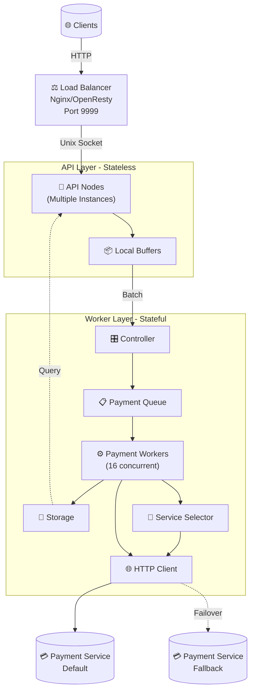

# RINHEX
- Minha aplicação em Elixir para a [terceira edição da Rinha de Back-end](https://github.com/zanfranceschi/rinha-de-backend-2025) do [@zanfranceschi](https://github.com/zanfranceschi).
- **(!)** Muitas práticas aplicadas neste projeto só estão aqui para performar para a competição e não devem ser copiadas em ambientes de produção.

## Tecnologias
- Linguagem: Elixir
- Load Balancer: NGINX/OpenResty
- Storage: Erlang Term Storage (ETS)
- Cluster Network: libcluster
- TCP Server: Thousand Island
- HTTP Client: Finch

## Arquitetura

