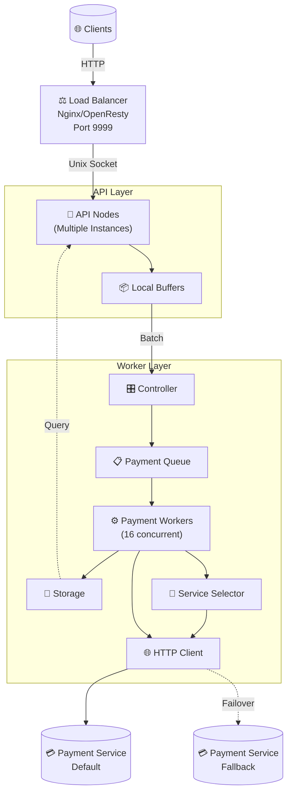

# RINHEX
- Minha aplicação em Elixir para a [terceira edição da Rinha de Back-end](https://github.com/zanfranceschi/rinha-de-backend-2025) do [@zanfranceschi](https://github.com/zanfranceschi).
- **(!)** Muitas práticas aplicadas neste projeto só estão aqui para performar para a competição e não devem ser copiadas em ambientes de produção.

## Tecnologias
- Linguagem: Elixir
- Load Balancer: NGINX/OpenResty
- Storage: Erlang Term Storage (ETS)
- Cluster Network: libcluster
- TCP Server: Thousand Island
- HTTP Client: Finch

## Arquitetura

- API Layer
  - Camada fina, com uma simples implementação de um servidor HTTP com base no Thousand Island.
  - Ao receber uma requisição de criação de pagamento, agrupa a requisição a outras utilizando um buffer local em memória (ETS).
  - Este buffer local é limpo após um período `X`, tendo seus itens enviados para a fila do _worker_.
- Worker
  - Possui o módulo `Rinhex.WorkerController` que implementa sua API pública a ser utilizada por outros membros do _cluster_.
  - Possui uma fila em memória (ETS) que é consumida por `N` instâncias do `GenServer`: `Rinhex.Payments.Worker`
  - Na execução bem sucedida de um ciclo do `Rinhex.Payments.Worker`, o pagamento recém criado é salvo pelo _worker_ em seu módulo `Rinhex.Storage`. Este módulo de armazenamento (em memória, ETS) define as funções utilizadas para o gerenciamento dos dados relacionados aos pagamentos processdados.
  - `Rinhex.Semaphore` e `Rinhex.SemaphoreWorker` compoem a lógica de _circuit break_, definindo qual _payment processor_ deve ser chamado no momento em que uma instância do `Rinhex.Payments.Worker` está para processar um pagamento.

