# RINHEX
- Minha aplicação em Elixir para a [terceira edição da Rinha de Back-end](https://github.com/zanfranceschi/rinha-de-backend-2025) do [@zanfranceschi](https://github.com/zanfranceschi).
- **(!)** Muitas práticas aplicadas neste projeto só estão aqui para performar para a competição e não devem ser copiadas em ambientes de produção.

## Tecnologias
- Linguagem: Elixir
- Load Balancer: NGINX/OpenResty
- Storage: Erlang Term Storage (ETS)
- Cluster Network: libcluster
- TCP Server: Thousand Island
- HTTP Client: Finch

## Arquitetura

```mermaid
graph TB
    Client[("🌐 Clients")]
    ExtService1[("💳 Payment Service<br/>Default")]
    ExtService2[("💳 Payment Service<br/>Fallback")]
    
    Nginx["⚖️ Load Balancer<br/>Nginx/OpenResty<br/>Port 9999"]
    
    subgraph "API Layer - Stateless"
        APIs["📡 API Nodes<br/>(Multiple Instances)"]
        Buffer["📦 Local Buffers"]
    end
    
    subgraph "Worker Layer - Stateful"
        Controller["🎛️ Controller"]
        Queue["📋 Payment Queue"]
        Workers["⚙️ Payment Workers<br/>(16 concurrent)"]
        Storage["💾 Storage"]
        Semaphore["🚦 Service Selector"]
        HTTP["🌐 HTTP Client"]
    end
    
    Client -->|HTTP| Nginx
    Nginx -->|Unix Socket| APIs
    
    APIs --> Buffer
    
    Buffer -->|Batch| Controller
    
    Controller --> Queue
    Queue --> Workers
    Workers --> Storage
    Workers --> Semaphore
    Semaphore --> HTTP
    Workers --> HTTP
    
    HTTP --> ExtService1
    HTTP -.->|Failover| ExtService2
    
    Storage -.->|Query| APIs
```

